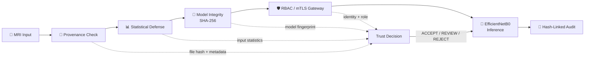
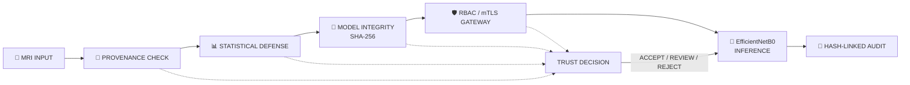

# 🧠 Beyond F1-Scores

### Zero-Trust, Adversarial-Resistant Brain Tumor AI

> **Can we trust an AI prediction—not just measure its accuracy?**

[](https://pytorch.org/vision/stable/models/generated/torchvision.models.efficientnet_b0.html)
[](#-performance)
[](#-security-architecture)
[](#-zero--trust-access-control)
[](#-zero--trust-access-control)
[](#-license)

---

## 🎯 Why this project?

Modern medical AI often focuses on one question:

> **How accurate is the model?**

This project asks a harder question:

> **Can the prediction still be trusted when the model, MRI input, user identity, or audit trail is under attack?**

**Beyond F1-Scores** combines a four-class brain tumor MRI classifier with a **Zero-Trust cybersecurity perimeter** around inference.

Instead of replacing the trained AI, the project protects the existing model with security decisions that happen **before, during, and after inference**.

### Core principle

```text
Accuracy
   +
Integrity
   +
Provenance
   +
Access Control
   +
Auditability
   =
Trusted AI Pipeline
```

---

# 🧩 System Architecture



### Zero-Trust rule

> **If an integrity, provenance, identity, authorization, or policy check fails, the request must not silently continue to inference.**

---

# 🔬 AI Baseline

The project uses **EfficientNetB0 with transfer learning** for four MRI classes:

| Class        | Description            |
| ------------ | ---------------------- |
| `glioma`     | Glioma tumor class     |
| `meningioma` | Meningioma tumor class |
| `notumor`    | No-tumor class         |
| `pituitary`  | Pituitary tumor class  |

The existing AI pipeline is intentionally preserved.

### Training strategy

```text
Pretrained EfficientNetB0
        ↓
Frozen feature extractor
        ↓
Custom Dropout + Linear classifier
        ↓
Classifier-head training
        ↓
Selective deeper-layer fine-tuning
        ↓
Four-class MRI classification
```

The cybersecurity contribution is deliberately **external to the trained model**.

---

# 🛡️ Security Architecture

## 1. 🔏 Model Integrity — SHA-256

The trained model is treated as a cryptographically identifiable artifact.

```text
brain_tumor_model.pth
        ↓
      SHA-256
        ↓
Trusted fingerprint
        ↓
Compare before inference
```

If the model file changes unexpectedly:

```text
Expected hash ≠ Actual hash
           ↓
      INTEGRITY FAIL
           ↓
        BLOCK
```

A controlled tamper-copy experiment is used so the original model remains untouched.

---

## 2. 🧾 MRI Provenance

Every protected input can be associated with a reproducible cryptographic footprint.

Tracked information includes:

* input file hash
* file metadata
* image representation
* request information
* timestamp
* model fingerprint

This provides **file-integrity and provenance tracking** for the inference pipeline.

> Provenance tracking does not by itself prove the clinical origin of an MRI.

---

## 3. 📊 Statistical Input Defense

Before inference, the security layer evaluates measurable properties of the input image.

Examples include:

* intensity statistics
* mean and standard deviation
* image dimensions
* range/consistency checks

Normal operating ranges are calibrated from project validation data.

Suspicious inputs can be routed to:

```text
ACCEPT
REVIEW
REJECT
```

The security policy is intentionally separated from **model confidence**.

---

## 4. 🎯 Security Trust Score

The project uses a dedicated **security trust score**.

It is **not**:

* diagnostic confidence
* disease probability
* medical certainty

It represents whether the inference request satisfies the project's security policy.

Example:

```text
Model Integrity       ✓
Provenance            ✓
Input Statistics      ✓
Authorization         ✓
Replay Check          ✓
                      ↓
                 TRUST SCORE
                      ↓
                    ACCEPT
```

Current validated demonstration:

**Trust Score: `100/100`**

---

# ⚔️ Adversarial Robustness

The project evaluates how the existing classifier behaves under controlled adversarial perturbations.

### FGSM experiment

```text
Clean MRI
   ↓
EfficientNetB0
   ↓
Baseline prediction

       +

Controlled perturbation
       ↓
Adversarial MRI
       ↓
EfficientNetB0
       ↓
Robustness measurement
```

The experiment measures the change between clean and perturbed inputs without updating the model weights.

This provides an **experimental robustness measurement**, not a claim of complete adversarial immunity.

---

# 🔐 Zero-Trust Access Control

Inference is not considered available to every user in every way.

### RBAC policy

| Role            | Predict | View Report | Manage Model |
| --------------- | :-----: | :---------: | :----------: |
| **Radiologist** |    ✅    |      ✅      |       ❌      |
| **Researcher**  |    ✅    |      ❌      |       ❌      |
| **Admin**       |    ✅    |      ✅      |       ✅      |

Negative authorization tests are intentionally part of the validation process.

Example:

```text
Researcher → view_report
           ↓
         DENIED
           ↓
      Security PASS
```

A denied unauthorized action is a **successful security result**, not an application failure.

---

# 🔒 Mutual TLS (mTLS)

The project includes a real local mutual-TLS demonstration.

```text
Client
  ↕
Certificate authentication
  ↕
Server
```

The validated workflow demonstrates:

```text
Valid client certificate
        ↓
     ACCEPT ✅

Missing / invalid client certificate
        ↓
     REJECT ✅
```

The implementation is a **local project demonstration** rather than a claim of production hospital-grade PKI infrastructure.

---

# ♻️ Replay Protection

Each protected inference request is associated with a unique request identifier.

A replayed request is rejected instead of silently being processed again.

```text
Request #001 → ACCEPT ✅
Request #001 → REPLAY → REJECT ✅
```

---

# 📜 Tamper-Evident Auditability

Security events are stored in a **hash-linked audit chain**.

```text
LOG₁
 │
 └── current_hash
        ↓
LOG₂
 │
 └── current_hash
        ↓
LOG₃
 │
 └── current_hash
```

Each record incorporates the previous record's cryptographic state.

### Tamper experiment

```text
Original audit chain → VALID ✅

Modify historical record
        ↓
Recalculate chain
        ↓
CHAIN INVALID
        ↓
TAMPER DETECTED ✅
```

This makes unauthorized historical modification detectable.

---

# 🚀 Secure Inference Gateway

The final protected inference path is:

```text
User Request
     ↓
mTLS
     ↓
RBAC
     ↓
Replay Check
     ↓
Model SHA-256 Verification
     ↓
MRI Provenance
     ↓
Statistical Defense
     ↓
Security Trust Decision
     ↓
Existing EfficientNetB0
     ↓
Prediction
     ↓
Hash-Linked Audit
```

### Key architectural idea

> **Security decisions sit around the model, not after it.**

The existing EfficientNetB0 classifier remains the intelligence engine; the Zero-Trust layer determines whether an inference request is trustworthy enough to reach it.

---

# 📈 Performance & Security

| Dimension                         | Validated Result |
| --------------------------------- | ---------------: |
| **Validation Accuracy**           |       **95.24%** |
| **Model Integrity**               |           ✅ PASS |
| **Model Tamper Detection**        |           ✅ PASS |
| **MRI Provenance**                |           ✅ PASS |
| **Statistical Defense**           |          ✅ VALID |
| **Security Trust Score**          |      **100/100** |
| **FGSM Robustness Evaluation**    |           ✅ PASS |
| **RBAC Policy Tests**             |           ✅ PASS |
| **mTLS Valid Client**             |           ✅ PASS |
| **mTLS Missing Client Rejection** |           ✅ PASS |
| **Replay Protection**             |           ✅ PASS |
| **Secure Inference Gateway**      |           ✅ PASS |
| **Audit Chain**                   |           ✅ PASS |
| **Audit Tamper Detection**        |           ✅ PASS |
| **Model Hash Preservation**       |           ✅ PASS |
| **Model Parameter Preservation**  |           ✅ PASS |

> Results above reflect the project's final validated execution. Detailed machine-readable evidence is available in the `security/` directory.

---

# 🧪 Security Validation Matrix

| Attack / Failure Scenario          | Security Response                           |
| ---------------------------------- | ------------------------------------------- |
| Modified model weights             | 🚫 Detected                                 |
| Unexpected MRI modification        | 🚫 Flagged by provenance/integrity controls |
| Suspicious input statistics        | 🚫 Review / reject policy                   |
| Unauthorized RBAC action           | 🚫 Denied                                   |
| Missing/invalid client certificate | 🚫 Rejected                                 |
| Replayed request                   | 🚫 Rejected                                 |
| Modified audit history             | 🚫 Tampering detected                       |
| Valid authorized inference         | ✅ Allowed                                   |

---

# 📂 Repository Structure

```text
.
├── README.md
├── LICENSE
├── .gitignore
│
├── notebooks/
│   └── MRI_Tumor_DETECTION_FINAL_ZEROTRUST.ipynb
│
├── security/
│   ├── SECURITY_RESULTS.md
│   ├── security_report.json
│   ├── security_metrics.csv
│   ├── statistical_policy.json
│   └── trusted_model_manifest.json
│
├── docs/
│   ├── ARCHITECTURE.md
│   ├── SECURITY.md
│   ├── THREAT_MODEL.md
│   └── REPRODUCTION.md
│
└── assets/
```

---

# ▶️ Reproducibility

The project is designed around a Google Colab workflow.

### High-level workflow

```text
1. Open the final notebook
2. Enable GPU runtime
3. Mount Google Drive
4. Provide the MRI dataset
5. Execute the existing AI pipeline
6. Execute the Zero-Trust security layer
7. Review the final security artifacts
```

The public repository intentionally excludes:

* raw MRI datasets
* private credentials
* certificates/private keys
* model weight files that are not intended for redistribution

This keeps the repository lightweight and avoids exposing sensitive or unnecessary artifacts.

---

# 📊 Evidence & Artifacts

Final security evidence is available under:

```text
security/
```

Key files include:

```text
SECURITY_RESULTS.md
security_report.json
security_metrics.csv
statistical_policy.json
trusted_model_manifest.json
```

These files provide reproducible evidence for the security controls implemented in the project.

---

# 🧠 Research Gap

Traditional model evaluation often stops at:

```text
Accuracy → F1 → Confusion Matrix
```

This project extends the evaluation boundary to:

```text
Accuracy
   ↓
Integrity
   ↓
Provenance
   ↓
Adversarial Robustness
   ↓
Identity & Authorization
   ↓
Replay Protection
   ↓
Auditability
```

The objective is not simply to ask:

> **"Can the model classify?"**

but also:

> **"Can we trust the prediction pipeline that produced the classification?"**

---

# ⚠️ Limitations & Responsible Use

This project is a **research and academic cybersecurity demonstration**.

It should not be interpreted as:

* a clinically validated diagnostic system
* a replacement for radiologists
* a production hospital security architecture
* proof of complete adversarial immunity
* proof of clinical safety
* proof of protection against all possible attacks

The security controls are validated within the project's experimental environment and threat model.

---

# 🔮 Future Work

Potential future extensions include:

* stronger adversarial defense strategies
* model signing and trusted key infrastructure
* hardware-backed key protection
* production-grade service isolation
* containerized deployment
* distributed audit storage
* continuous security monitoring
* explainable AI integration
* broader robustness benchmarking
* deployment-oriented privacy controls

---

# 👥 Team

**BCSE306L — Artificial Intelligence**

Project:

**Beyond F1-Scores: Architecting Zero-Trust, Adversarial-Resistant Deep Learning Frameworks for Brain Tumor Classification**

---

# 📚 References

The implementation and project framing are based on the team's AI project specification, security architecture, and final experimental notebook.

Relevant technologies include:

* PyTorch
* Torchvision
* EfficientNetB0
* SHA-256
* Python SSL/TLS
* Role-Based Access Control
* FGSM adversarial evaluation
* Hash-linked audit logging
* Google Colab

---

## ⭐ The Core Idea

> **High accuracy is the beginning of trustworthy AI—not the end.**

**Beyond F1-Scores** places a Zero-Trust security perimeter around an existing medical AI classifier so that **model integrity, MRI provenance, authorization, adversarial robustness, replay protection, and auditability become part of the inference pipeline itself.**

---

### 🔐 Accuracy tells us what the model can do.

### 🛡️ Zero-Trust asks whether we should trust how it did it.


# 🧬 AI Baseline

The underlying classifier uses **EfficientNetB0 transfer learning** to classify four MRI categories:

| Class        | Category   |
| ------------ | ---------- |
| `glioma`     | Glioma     |
| `meningioma` | Meningioma |
| `notumor`    | No Tumor   |
| `pituitary`  | Pituitary  |

### Existing training pipeline

```text
Pretrained EfficientNetB0
          ↓
Frozen Feature Extractor
          ↓
Custom Dropout + Linear Classifier
          ↓
Classifier-Head Training
          ↓
Selective Fine-Tuning
          ↓
Four-Class MRI Classification
```

The cybersecurity layer was added **around the existing model** rather than replacing it.

---

# 🏗️ Zero-Trust Architecture



### Core security rule

> **If an integrity, provenance, identity, authorization, or policy check fails, the request must not silently continue to inference.**

---

# 🔐 Security Layers

## 01 — Model Integrity

The trained model is treated as a cryptographically identifiable artifact.

```text
brain_tumor_model.pth
        ↓
      SHA-256
        ↓
Trusted Fingerprint
        ↓
Compare Before Inference
```

### Tamper scenario

```text
Expected Hash ≠ Actual Hash
          ↓
     INTEGRITY FAIL
          ↓
        BLOCK
```

A controlled tamper-copy experiment verifies that unauthorized weight changes are detectable while the original model remains unchanged.

---

## 02 — MRI Provenance

Each protected MRI input receives a reproducible cryptographic footprint.

The security layer tracks information such as:

* file hash
* file metadata
* image representation
* request identifier
* timestamp
* model fingerprint

> Provenance tracking provides file-integrity and traceability information; it does not by itself establish clinical origin.

---

## 03 — Statistical Input Defense

Before inference, measurable image properties are evaluated.

Examples include:

* image dimensions
* mean intensity
* standard deviation
* intensity range
* consistency checks

Thresholds are derived from project validation data and used to identify abnormal inputs.

```text
MRI
 ↓
Statistical Analysis
 ↓
Security Policy
 ↓
ACCEPT / REVIEW / REJECT
```

---

## 04 — Security Trust Score

The project uses a dedicated **security trust score**.

This is **not**:

* medical confidence,
* disease probability,
* diagnostic certainty.

It represents whether the request satisfies the project's security policy.

### Example

```text
Model Integrity       ✓
MRI Provenance        ✓
Statistical Defense   ✓
Authorization         ✓
Replay Check          ✓
                      ↓
                 TRUST SCORE
                      ↓
                   ACCEPT
```

### Validated demonstration

**Security Trust Score: `100/100`**

---

# ⚔️ Adversarial Robustness

The project evaluates how the existing classifier behaves under controlled adversarial perturbations using **FGSM**.

```text
             Clean MRI
                 ↓
           EfficientNetB0
                 ↓
          Baseline Result

                  +

         Adversarial Perturbation
                  ↓
          Adversarial MRI
                  ↓
           EfficientNetB0
                  ↓
        Robustness Measurement
```

The experiment measures performance degradation without updating the model parameters.

> FGSM is used as an experimental robustness benchmark, not as proof that the system is immune to adversarial attacks.

---

# 🛡️ Zero-Trust Access Control

Inference is not equally available to every user.

| Role            | Predict | View Report | Manage Model |
| :-------------- | :-----: | :---------: | :----------: |
| **Radiologist** |    ✅    |      ✅      |       ❌      |
| **Researcher**  |    ✅    |      ❌      |       ❌      |
| **Admin**       |    ✅    |      ✅      |       ✅      |

Negative authorization tests are intentionally included.

```text
Researcher
    ↓
view_report
    ↓
DENIED
    ↓
Security Control PASS
```

A deliberate access denial is a **successful security result**, not an application failure.

---

# 🔒 Mutual TLS

The project includes a real local **mutual TLS (mTLS)** demonstration.

```text
Client Certificate
        ↕
 Certificate Validation
        ↕
      Server
```

Validated scenarios:

```text
Valid Client Certificate
        ↓
      ACCEPT ✅


Missing / Invalid Client Certificate
        ↓
      REJECT ✅
```

This is a local research demonstration of mutual authentication, not a claim of production hospital PKI.

---

# ♻️ Replay Protection

Every protected inference request is associated with a unique request identifier.

```text
Request #001  → ACCEPT ✅
Request #001  → REPLAY → REJECT ✅
```

This prevents the same protected request from being silently processed multiple times.

---

# 📜 Tamper-Evident Audit Trail

Security events are stored using a **hash-linked audit chain**.

```text
LOG₁
 │
 └── current_hash
        ↓
LOG₂
 │
 └── current_hash
        ↓
LOG₃
 │
 └── current_hash
```

Each event cryptographically incorporates the state of the previous event.

### Tamper experiment

```text
Original Audit Chain
        ↓
      VALID ✅

Historical Entry Modified
        ↓
Chain Verification
        ↓
TAMPER DETECTED ✅
```

---

# 🚀 Secure Inference Gateway

The final protected inference path is:

```text
User Request
      ↓
   mTLS
      ↓
    RBAC
      ↓
Replay Protection
      ↓
Model SHA-256 Verification
      ↓
MRI Provenance
      ↓
Statistical Defense
      ↓
Security Trust Decision
      ↓
Existing EfficientNetB0
      ↓
Prediction
      ↓
Hash-Linked Audit
```

### Architectural contribution

> **Security decisions sit around the model — not after it.**

The AI model remains the classification engine.
The Zero-Trust layer decides whether an inference request is trustworthy enough to reach it.

---

# 📊 Performance & Security Results

| Metric                            | Final Result |
| --------------------------------- | -----------: |
| **Validation Accuracy**           |   **95.24%** |
| **Model Integrity**               |       ✅ PASS |
| **Model Tamper Detection**        |       ✅ PASS |
| **MRI Provenance**                |       ✅ PASS |
| **Statistical Defense**           |      ✅ VALID |
| **Security Trust Score**          |  **100/100** |
| **FGSM Robustness Evaluation**    |       ✅ PASS |
| **RBAC Policy Tests**             |       ✅ PASS |
| **RBAC Negative Tests**           |       ✅ PASS |
| **mTLS Valid Client**             |       ✅ PASS |
| **mTLS Missing Client Rejection** |       ✅ PASS |
| **Replay Protection**             |       ✅ PASS |
| **Secure Inference Gateway**      |       ✅ PASS |
| **Audit Chain**                   |       ✅ PASS |
| **Audit Tamper Detection**        |       ✅ PASS |
| **Model File Hash Preserved**     |       ✅ PASS |
| **Model Parameters Preserved**    |       ✅ PASS |

---

# 🧪 Security Validation Matrix

| Scenario                      | Expected Security Behaviour | Result |
| ----------------------------- | --------------------------- | :----: |
| Modified model weights        | Detect and block            |    ✅   |
| Valid MRI provenance          | Accept                      |    ✅   |
| Suspicious input statistics   | Review / reject             |    ✅   |
| Unauthorized RBAC action      | Deny                        |    ✅   |
| Valid mTLS client             | Accept                      |    ✅   |
| Missing / invalid mTLS client | Reject                      |    ✅   |
| Replayed request              | Reject                      |    ✅   |
| Modified audit history        | Detect tampering            |    ✅   |
| Valid authorized inference    | Allow                       |    ✅   |

---

# 🧠 Why "Beyond F1-Scores"?

Traditional evaluation often ends here:

```text
Accuracy
   ↓
Precision
   ↓
Recall
   ↓
F1
   ↓
Done
```

This project expands the evaluation boundary:

```text
Accuracy
   ↓
Integrity
   ↓
Provenance
   ↓
Adversarial Robustness
   ↓
Identity & Authorization
   ↓
Replay Protection
   ↓
Auditability
```

The goal is not only:

> **Can the model classify the MRI?**

It is also:

> **Can we trust the pipeline that produced the classification?**

---

# 📁 Repository Structure

```text
.
├── README.md
├── LICENSE
├── .gitignore
│
├── notebooks/
│   └── MRI_Tumor_DETECTION_FINAL_ZEROTRUST.ipynb
│
├── security/
│   ├── SECURITY_RESULTS.md
│   ├── security_report.json
│   ├── security_metrics.csv
│   ├── statistical_policy.json
│   └── trusted_model_manifest.json
│
├── docs/
│   ├── ARCHITECTURE.md
│   ├── SECURITY.md
│   ├── THREAT_MODEL.md
│   └── REPRODUCTION.md
│
└── assets/
```

---

# ▶️ Reproduction

The project is designed around a Google Colab workflow.

### High-level process

```text
1. Open the final notebook
2. Enable a GPU runtime
3. Mount Google Drive
4. Provide the MRI dataset
5. Execute the existing AI pipeline
6. Execute the Zero-Trust security layer
7. Review the generated security artifacts
```

The public repository intentionally excludes:

* raw MRI datasets
* credentials
* private certificates and keys
* model weights that are not intended for redistribution

---

# 📦 Security Evidence

Final evidence is stored under:

```text
security/
```

Key artifacts:

```text
SECURITY_RESULTS.md
security_report.json
security_metrics.csv
statistical_policy.json
trusted_model_manifest.json
```

These contain the machine-readable and human-readable evidence generated by the final validation workflow.

---

# 🧬 Research Contribution

The project addresses four gaps identified in the original project definition:

### Accuracy-Only Fallacy

Performance metrics alone do not establish deployment trust.

### Cryptographic Vulnerability

Model files can be modified without necessarily preventing inference.

### Zero Adversarial Resilience

Input images should not automatically be considered trustworthy.

### Diagnostic Auditability

Secure inference should be attributable, reviewable, and tamper-evident.

---

# ⚠️ Limitations & Responsible Use

This is an **academic research and cybersecurity engineering project**.

It is **not**:

* a clinically validated diagnostic system
* a replacement for a radiologist
* a production hospital deployment
* proof of complete adversarial immunity
* proof of clinical safety
* protection against every possible attack

The security controls are validated within the project's experimental environment and defined threat model.

Any clinical deployment would require substantially broader validation, governance, privacy protection, infrastructure security, and regulatory review.

---

# 🔮 Future Work

Potential extensions include:

* stronger adversarial defenses
* model signing and trusted key infrastructure
* hardware-backed key protection
* containerized deployment
* production-grade service isolation
* distributed audit storage
* continuous security monitoring
* explainable AI
* larger robustness benchmarks
* privacy-preserving inference
* deployment-oriented threat modeling

---

# 👥 Team

### BCSE306L — Artificial Intelligence

**Project:**
**Beyond F1-Scores: Architecting Zero-Trust, Adversarial-Resistant Deep Learning Frameworks for Brain Tumor Classification**

---

# 🔗 Technologies

* Python
* PyTorch
* Torchvision
* EfficientNetB0
* Google Colab
* SHA-256
* Python SSL/TLS
* RBAC
* FGSM
* Hash-linked audit logging

---

# 📚 References

Project framing, implementation methodology, and validation are based on the team's AI course project specification, Zero-Trust architecture, and final executed notebook.

Third-party pretrained components and datasets remain subject to their respective licenses and terms.

---

# ⭐ Final Takeaway

> ## **High accuracy is the beginning of trustworthy AI — not the end.**

**Beyond F1-Scores** places a Zero-Trust security perimeter around an existing brain tumor MRI classifier so that **integrity, provenance, adversarial robustness, authorization, replay protection, and auditability become part of the inference pipeline itself.**

```text
          ┌───────────────────────┐
          │    ACCURATE AI        │
          └───────────┬───────────┘
                      ↓
          ┌───────────────────────┐
          │   ZERO-TRUST LAYER    │
          ├───────────────────────┤
          │ Integrity             │
          │ Provenance            │
          │ Defense               │
          │ Authorization         │
          │ Replay Protection     │
          │ Auditability          │
          └───────────┬───────────┘
                      ↓
          ┌───────────────────────┐
          │    TRUSTED INFERENCE  │
          └───────────────────────┘
```

**Accuracy tells us what the model can do.**
**Zero-Trust asks whether we should trust how it did it.**

```
```
