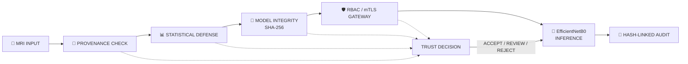

````markdown
# 🧠 Beyond F1-Scores

### Zero-Trust, Adversarial-Resistant Brain Tumor AI

> **Can we trust an AI prediction—not just measure its accuracy?**


---

## 🚨 The Problem

Medical AI is often evaluated with one question:

> **How accurate is the model?**

But a high-performing model can still become unsafe if:

- its weight file is silently modified,
- the MRI input is manipulated,
- an unauthorized user accesses inference,
- a request is replayed,
- or the diagnostic audit trail is altered.

That creates the central question of this project:

> ## **Can we trust the prediction — not just the accuracy number?**

---

# 🎯 Project Vision

**Beyond F1-Scores** combines a brain tumor MRI classifier with a **Zero-Trust cybersecurity perimeter** around inference.

Instead of changing the trained AI model, the project protects the existing classifier through:

```text
Accuracy
   +
Integrity
   +
Provenance
   +
Adversarial Robustness
   +
Access Control
   +
Auditability
   =
Trusted AI Pipeline
````

---

# 🧬 AI Baseline

The underlying classifier uses **EfficientNetB0 transfer learning** to classify four MRI categories:

| Class        | Category   |
| ------------ | ---------- |
| `glioma`     | Glioma     |
| `meningioma` | Meningioma |
| `notumor`    | No Tumor   |
| `pituitary`  | Pituitary  |

### Existing training pipeline

```text
Pretrained EfficientNetB0
          ↓
Frozen Feature Extractor
          ↓
Custom Dropout + Linear Classifier
          ↓
Classifier-Head Training
          ↓
Selective Fine-Tuning
          ↓
Four-Class MRI Classification
```

The cybersecurity layer was added **around the existing model** rather than replacing it.

---

# 🏗️ Zero-Trust Architecture



### Core security rule

> **If an integrity, provenance, identity, authorization, or policy check fails, the request must not silently continue to inference.**

---

# 🔐 Security Layers

## 01 — Model Integrity

The trained model is treated as a cryptographically identifiable artifact.

```text
brain_tumor_model.pth
        ↓
      SHA-256
        ↓
Trusted Fingerprint
        ↓
Compare Before Inference
```

### Tamper scenario

```text
Expected Hash ≠ Actual Hash
          ↓
     INTEGRITY FAIL
          ↓
        BLOCK
```

A controlled tamper-copy experiment verifies that unauthorized weight changes are detectable while the original model remains unchanged.

---

## 02 — MRI Provenance

Each protected MRI input receives a reproducible cryptographic footprint.

The security layer tracks information such as:

* file hash
* file metadata
* image representation
* request identifier
* timestamp
* model fingerprint

> Provenance tracking provides file-integrity and traceability information; it does not by itself establish clinical origin.

---

## 03 — Statistical Input Defense

Before inference, measurable image properties are evaluated.

Examples include:

* image dimensions
* mean intensity
* standard deviation
* intensity range
* consistency checks

Thresholds are derived from project validation data and used to identify abnormal inputs.

```text
MRI
 ↓
Statistical Analysis
 ↓
Security Policy
 ↓
ACCEPT / REVIEW / REJECT
```

---

## 04 — Security Trust Score

The project uses a dedicated **security trust score**.

This is **not**:

* medical confidence,
* disease probability,
* diagnostic certainty.

It represents whether the request satisfies the project's security policy.

### Example

```text
Model Integrity       ✓
MRI Provenance        ✓
Statistical Defense   ✓
Authorization         ✓
Replay Check          ✓
                      ↓
                 TRUST SCORE
                      ↓
                   ACCEPT
```

### Validated demonstration

**Security Trust Score: `100/100`**

---

# ⚔️ Adversarial Robustness

The project evaluates how the existing classifier behaves under controlled adversarial perturbations using **FGSM**.

```text
             Clean MRI
                 ↓
           EfficientNetB0
                 ↓
          Baseline Result

                  +

         Adversarial Perturbation
                  ↓
          Adversarial MRI
                  ↓
           EfficientNetB0
                  ↓
        Robustness Measurement
```

The experiment measures performance degradation without updating the model parameters.

> FGSM is used as an experimental robustness benchmark, not as proof that the system is immune to adversarial attacks.

---

# 🛡️ Zero-Trust Access Control

Inference is not equally available to every user.

| Role            | Predict | View Report | Manage Model |
| :-------------- | :-----: | :---------: | :----------: |
| **Radiologist** |    ✅    |      ✅      |       ❌      |
| **Researcher**  |    ✅    |      ❌      |       ❌      |
| **Admin**       |    ✅    |      ✅      |       ✅      |

Negative authorization tests are intentionally included.

```text
Researcher
    ↓
view_report
    ↓
DENIED
    ↓
Security Control PASS
```

A deliberate access denial is a **successful security result**, not an application failure.

---

# 🔒 Mutual TLS

The project includes a real local **mutual TLS (mTLS)** demonstration.

```text
Client Certificate
        ↕
 Certificate Validation
        ↕
      Server
```

Validated scenarios:

```text
Valid Client Certificate
        ↓
      ACCEPT ✅


Missing / Invalid Client Certificate
        ↓
      REJECT ✅
```

This is a local research demonstration of mutual authentication, not a claim of production hospital PKI.

---

# ♻️ Replay Protection

Every protected inference request is associated with a unique request identifier.

```text
Request #001  → ACCEPT ✅
Request #001  → REPLAY → REJECT ✅
```

This prevents the same protected request from being silently processed multiple times.

---

# 📜 Tamper-Evident Audit Trail

Security events are stored using a **hash-linked audit chain**.

```text
LOG₁
 │
 └── current_hash
        ↓
LOG₂
 │
 └── current_hash
        ↓
LOG₃
 │
 └── current_hash
```

Each event cryptographically incorporates the state of the previous event.

### Tamper experiment

```text
Original Audit Chain
        ↓
      VALID ✅

Historical Entry Modified
        ↓
Chain Verification
        ↓
TAMPER DETECTED ✅
```

---

# 🚀 Secure Inference Gateway

The final protected inference path is:

```text
User Request
      ↓
   mTLS
      ↓
    RBAC
      ↓
Replay Protection
      ↓
Model SHA-256 Verification
      ↓
MRI Provenance
      ↓
Statistical Defense
      ↓
Security Trust Decision
      ↓
Existing EfficientNetB0
      ↓
Prediction
      ↓
Hash-Linked Audit
```

### Architectural contribution

> **Security decisions sit around the model — not after it.**

The AI model remains the classification engine.
The Zero-Trust layer decides whether an inference request is trustworthy enough to reach it.

---

# 📊 Performance & Security Results

| Metric                            | Final Result |
| --------------------------------- | -----------: |
| **Validation Accuracy**           |   **95.24%** |
| **Model Integrity**               |       ✅ PASS |
| **Model Tamper Detection**        |       ✅ PASS |
| **MRI Provenance**                |       ✅ PASS |
| **Statistical Defense**           |      ✅ VALID |
| **Security Trust Score**          |  **100/100** |
| **FGSM Robustness Evaluation**    |       ✅ PASS |
| **RBAC Policy Tests**             |       ✅ PASS |
| **RBAC Negative Tests**           |       ✅ PASS |
| **mTLS Valid Client**             |       ✅ PASS |
| **mTLS Missing Client Rejection** |       ✅ PASS |
| **Replay Protection**             |       ✅ PASS |
| **Secure Inference Gateway**      |       ✅ PASS |
| **Audit Chain**                   |       ✅ PASS |
| **Audit Tamper Detection**        |       ✅ PASS |
| **Model File Hash Preserved**     |       ✅ PASS |
| **Model Parameters Preserved**    |       ✅ PASS |

---

# 🧪 Security Validation Matrix

| Scenario                      | Expected Security Behaviour | Result |
| ----------------------------- | --------------------------- | :----: |
| Modified model weights        | Detect and block            |    ✅   |
| Valid MRI provenance          | Accept                      |    ✅   |
| Suspicious input statistics   | Review / reject             |    ✅   |
| Unauthorized RBAC action      | Deny                        |    ✅   |
| Valid mTLS client             | Accept                      |    ✅   |
| Missing / invalid mTLS client | Reject                      |    ✅   |
| Replayed request              | Reject                      |    ✅   |
| Modified audit history        | Detect tampering            |    ✅   |
| Valid authorized inference    | Allow                       |    ✅   |

---

# 🧠 Why "Beyond F1-Scores"?

Traditional evaluation often ends here:

```text
Accuracy
   ↓
Precision
   ↓
Recall
   ↓
F1
   ↓
Done
```

This project expands the evaluation boundary:

```text
Accuracy
   ↓
Integrity
   ↓
Provenance
   ↓
Adversarial Robustness
   ↓
Identity & Authorization
   ↓
Replay Protection
   ↓
Auditability
```

The goal is not only:

> **Can the model classify the MRI?**

It is also:

> **Can we trust the pipeline that produced the classification?**

---

# 📁 Repository Structure

```text
.
├── README.md
├── LICENSE
├── .gitignore
│
├── notebooks/
│   └── MRI_Tumor_DETECTION_FINAL_ZEROTRUST.ipynb
│
├── security/
│   ├── SECURITY_RESULTS.md
│   ├── security_report.json
│   ├── security_metrics.csv
│   ├── statistical_policy.json
│   └── trusted_model_manifest.json
│
├── docs/
│   ├── ARCHITECTURE.md
│   ├── SECURITY.md
│   ├── THREAT_MODEL.md
│   └── REPRODUCTION.md
│
└── assets/
```

---

# ▶️ Reproduction

The project is designed around a Google Colab workflow.

### High-level process

```text
1. Open the final notebook
2. Enable a GPU runtime
3. Mount Google Drive
4. Provide the MRI dataset
5. Execute the existing AI pipeline
6. Execute the Zero-Trust security layer
7. Review the generated security artifacts
```

The public repository intentionally excludes:

* raw MRI datasets
* credentials
* private certificates and keys
* model weights that are not intended for redistribution

---

# 📦 Security Evidence

Final evidence is stored under:

```text
security/
```

Key artifacts:

```text
SECURITY_RESULTS.md
security_report.json
security_metrics.csv
statistical_policy.json
trusted_model_manifest.json
```

These contain the machine-readable and human-readable evidence generated by the final validation workflow.

---

# 🧬 Research Contribution

The project addresses four gaps identified in the original project definition:

### Accuracy-Only Fallacy

Performance metrics alone do not establish deployment trust.

### Cryptographic Vulnerability

Model files can be modified without necessarily preventing inference.

### Zero Adversarial Resilience

Input images should not automatically be considered trustworthy.

### Diagnostic Auditability

Secure inference should be attributable, reviewable, and tamper-evident.

---

# ⚠️ Limitations & Responsible Use

This is an **academic research and cybersecurity engineering project**.

It is **not**:

* a clinically validated diagnostic system
* a replacement for a radiologist
* a production hospital deployment
* proof of complete adversarial immunity
* proof of clinical safety
* protection against every possible attack

The security controls are validated within the project's experimental environment and defined threat model.

Any clinical deployment would require substantially broader validation, governance, privacy protection, infrastructure security, and regulatory review.

---

# 🔮 Future Work

Potential extensions include:

* stronger adversarial defenses
* model signing and trusted key infrastructure
* hardware-backed key protection
* containerized deployment
* production-grade service isolation
* distributed audit storage
* continuous security monitoring
* explainable AI
* larger robustness benchmarks
* privacy-preserving inference
* deployment-oriented threat modeling

---

# 👥 Team

### BCSE306L — Artificial Intelligence

**Project:**
**Beyond F1-Scores: Architecting Zero-Trust, Adversarial-Resistant Deep Learning Frameworks for Brain Tumor Classification**

---

# 🔗 Technologies

* Python
* PyTorch
* Torchvision
* EfficientNetB0
* Google Colab
* SHA-256
* Python SSL/TLS
* RBAC
* FGSM
* Hash-linked audit logging

---

# 📚 References

Project framing, implementation methodology, and validation are based on the team's AI course project specification, Zero-Trust architecture, and final executed notebook.

Third-party pretrained components and datasets remain subject to their respective licenses and terms.

---

# ⭐ Final Takeaway

> ## **High accuracy is the beginning of trustworthy AI — not the end.**

**Beyond F1-Scores** places a Zero-Trust security perimeter around an existing brain tumor MRI classifier so that **integrity, provenance, adversarial robustness, authorization, replay protection, and auditability become part of the inference pipeline itself.**

```text
          ┌───────────────────────┐
          │    ACCURATE AI        │
          └───────────┬───────────┘
                      ↓
          ┌───────────────────────┐
          │   ZERO-TRUST LAYER    │
          ├───────────────────────┤
          │ Integrity             │
          │ Provenance            │
          │ Defense               │
          │ Authorization         │
          │ Replay Protection     │
          │ Auditability          │
          └───────────┬───────────┘
                      ↓
          ┌───────────────────────┐
          │    TRUSTED INFERENCE  │
          └───────────────────────┘
```

**Accuracy tells us what the model can do.**
**Zero-Trust asks whether we should trust how it did it.**

```
```
