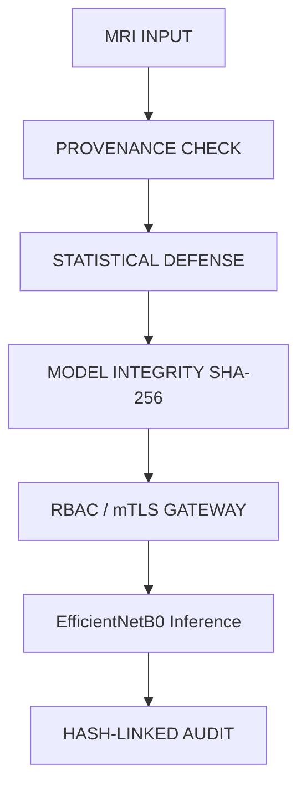

# Beyond F1-Scores: Zero-Trust Brain Tumor AI

**"Can we trust an AI prediction—not just measure its accuracy?"**

## Architecture

## Performance & Security Matrix
| Metric | Value |
|---|---|
| Validation Accuracy | 0.9524 |
| Model Integrity | PASS |
| mTLS / RBAC | VALIDATED |
| Trust Score | 100/100 |

*Note: Model weights and raw data excluded for security.*
